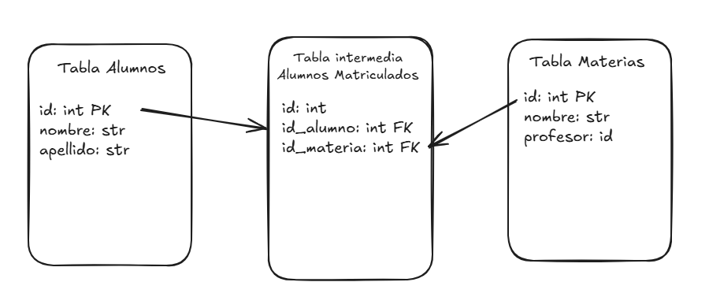
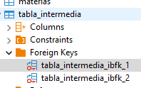
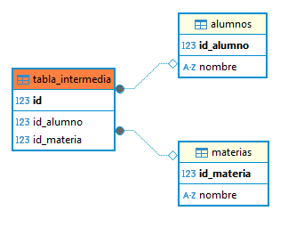
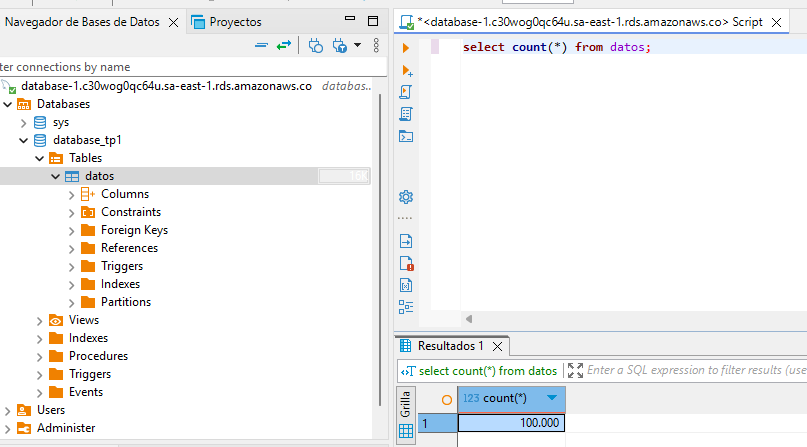
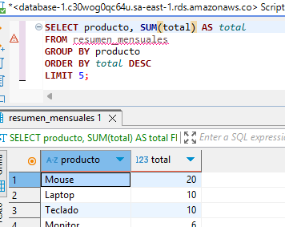

# TP1 Bases de Datos 2

#### Participantes:
- [Raphael Nicaise](https://github.com/RaphaelNicaise)
- [Santiago Segal](https://github.com/Santucho12)
- [Abner Grgurich](https://github.com/Abner2646)
- [Nicolas Cordano](https://github.com/NACXIIX)

<hr style="height:1px; border:none; background-color:#e1e4e8;" />

> ℹ️ Para algunos puntos se requiere el uso de una base de datos, por eso aprovechamos el poder la nube, y levantamos una base de datos en AWS. En este caso, utilizamos Amazon RDS para crear una base de datos MySQL, y mediante un RDBMS, en nuestro caso DBeaver, nos conectamos a la base de datos y ejecutamos los scripts.

<hr style="height:1px; border:none; background-color:#e1e4e8;" />

### 1.
Teniendo una tabla intermedia que relaciona a los alumnos y las materias mediante sus respectivos ID:


Una posible violacion de la integridad referencial ocurre en el caso que eliminemos a un alumno de la tabla alumnos. En este caso, la tabla intermedia quedaria con un registro que no tiene un alumno asociado. Esto porque la tabla intermedia depende de la tabla alumnos para su existencia.

Para resolver esto podemos hacer lo siguiente al crear la tabla (o aplicarle alter table):
```sql
    CREATE TABLE tabla_intermedia (
    id INT AUTO_INCREMENT,
    id_alumno INT,
    id_materia INT,
    PRIMARY KEY (id),
    FOREIGN KEY (id_alumno) REFERENCES Alumnos(id_alumno) ON DELETE CASCADE,
    FOREIGN KEY (id_materia) REFERENCES Materias(id_materia)
);

```

Le agregamos una constraint al campo id_alumno (fk de alumnos) `ON DELETE CASCADE`, el cual hace que si detecta que se elimina un registro de la tabla alumnos, elimine todos los registros de la tabla intermedia que tengan ese id_alumno, resolviendo asi el problema.

<hr style="height:1px; border:none; background-color:#e1e4e8;" />

### 2.




Teniendo en cuenta la tabla intermedia del punto [.1](#1) (que relaciona alumnos y materias), si intentamos insertar un registro con un id_alumno o id_materia inexistentes, como este:

```sql
INSERT INTO tabla_intermedia (id_alumno, id_materia) VALUES (99, 12);
```
> ❗ ERROR 1452 (23000): Cannot add or update a child row: a foreign key constraint fails (`database_tp1`.`tabla_intermedia`, CONSTRAINT `tabla_intermedia_ibfk_1` FOREIGN KEY (`id_alumno`) REFERENCES `alumnos` (`id_alumno`))

<hr style="height:1px; border:none; background-color:#e1e4e8;" />

### 3.

<hr style="height:1px; border:none; background-color:#e1e4e8;" />

### 4.
Primero debemos crear una tabla en nuestra base de datos en AWS e ingresarle datos, yo decidi crear un script simple para crear 100.000 registros en csv y despues insertarlos a la tabla.

```sql
CREATE TABLE datos (
    id INT,
    palabra VARCHAR(10)
)
```

Creamos archivo `datos_100k.csv`:
```python
import pandas as pd
import random

palabras = ['abcd1', 'efgh2', 'sdfsd3', 'jahif4']

data = {
    'id': range(1, 100001),
    'palabra': [random.choice(palabras) for _ in range(100000)]
}

df = pd.DataFrame(data)

df.to_csv('datos_100k.csv', index=False)
```
- Los insertamos con la herramienta de import data from csv y ya estarian los 100.000 registros listos.



- Ahora si, ejecutamos la siguiente query sin index:
```sql
EXPLAIN SELECT * FROM datos WHERE palabra = 'efgh2';
```
Salida:
| Tiempo de Ejecucion        | type     | rows     |
|---------------|---------------|---------------|
| 0.50s       | All    | 100.000    |


Ahora creamos un index sobre la columna palabra:
```sql
CREATE INDEX idx_palabra ON datos (palabra);
```
Y ejecutamos la misma query:
```sql
EXPLAIN SELECT * FROM datos WHERE palabra = 'efgh2';
```
Salida:
| Tiempo de Ejecucion        | type     | rows     |
|---------------|---------------|---------------|
| 0.001s       | ref    | 44792   |

> ✅ El tiempo de ejecucion bajo considerablemente, y el tipo de busqueda cambio a ref, lo que indica que ahora se esta utilizando el index para buscar los registros.

<hr style="height:1px; border:none; background-color:#e1e4e8;" />

### 5.

Para eso antes debemos crear la tabla Ventas:
```sql
CREATE TABLE ventas (
    id INT PRIMARY KEY AUTO_INCREMENT,
    producto VARCHAR(100),
    cantidad INT,
    fecha DATE
);
```

Y luego creamos una vista que nos muestre las ventas totales por mes y año por producto:
```sql
CREATE VIEW resumen_mensuales AS
SELECT producto, YEAR(fecha) AS anio, MONTH(fecha) AS mes, SUM(cantidad) AS total
FROM ventas
GROUP BY producto, anio, mes;
```


<details>
<summary> Insertamos algunos datos para probar la vista</summary>

```sql
INSERT INTO ventas (producto, cantidad, fecha) VALUES
('Laptop', 3, '2024-01-15'),
('Laptop', 2, '2024-01-20'),
('Laptop', 5, '2024-02-10'),
('Mouse', 10, '2024-01-05'),
('Mouse', 7, '2024-02-07'),
('Mouse', 3, '2024-02-28'),
('Teclado', 4, '2024-01-12'),
('Teclado', 6, '2024-03-03'),
('Monitor', 2, '2024-01-25'),
('Monitor', 4, '2024-03-10');
```
</details>

Ya podemos hacer la consulta a la vista:
- Los 5 productos mas vendidos
```sql
SELECT producto, SUM(total_vendido) AS total
FROM resumen_mensual
GROUP BY producto
ORDER BY total DESC
LIMIT 5;
```



<hr style="height:1px; border:none; background-color:#e1e4e8;" />

### 6.

<hr style="height:1px; border:none; background-color:#e1e4e8;" />

### 7.

Creamos un usuario analista y le damos permisos de solo lectura a la base de datos:
```sql
CREATE USER 'analista'@'%' IDENTIFIED BY 'analista123';
GRANT SELECT ON database_tp1.* TO 'analista'@'%';
FLUSH PRIVILEGES; -- esto es importante para que los cambios tengan efecto
```
Ejecutamos esta consulta para ver que permisos tiene:
```sql
SELECT User,Select_priv,Insert_priv  FROM mysql.user user WHERE user.`User` LIKE 'analista'
```
> ✅ Tiene permisos de SELECT pero no de INSERT, lo que indica que no puede modificar la base de datos.

Testiemos esto:
```sql
INSERT INTO datos (id, palabra) VALUES (100001, 'test');
```

> ❗ ERROR 1142 (42000): INSERT command denied to user 'analista'@'%' for table 'clientes'

<hr style="height:1px; border:none; background-color:#e1e4e8;" />

### 8.
Vamos a crear la tabla Clientes y Auditoria Clientes:
```sql
CREATE TABLE clientes(
    id INT AUTO_INCREMENT PRIMARY KEY,
    nombre VARCHAR(50),
    email VARCHAR(100)
)

CREATE TABLE auditoria_email_clientes(
    id INT AUTO_INCREMENT PRIMARY KEY,
    id_cliente INT,
    email_cliente VARCHAR(100),
    fecha TIMESTAMP DEFAULT CURRENT_TIMESTAMP,
    FOREIGN KEY (id_cliente) REFERENCES clientes(id)
)
```

En este ejemplo queremos registrar cuando un cliente actualiza su mail, procedemos a crear el trigger sobre la tabla clientes:
```sql
DELIMITER // --recordar cambiar el delimitador para crear el trigger
CREATE TRIGGER auditar_email_clientes_trigger
AFTER UPDATE ON clientes
FOR EACH ROW
BEGIN
    IF OLD.email <> NEW.email THEN
        INSERT INTO auditoria_email_clientes (id_cliente, email_cliente)
        VALUES (NEW.id, NEW.email);
    END IF;
END //
```
> ℹ️ La validacion (OLD.email <> NEW.email) la ponemos ya que el trigger se ejecutaria tambien si se cambia el nombre u otro campo, con eso aseguramos que solo se ejecute si el email cambia.

<image src="assets/dbeaverp8.png">

> ✅ Ahora cada vez que se actualice el email de un cliente, se insertara un registro en la tabla auditoria_email_clientes con el id del cliente y el nuevo email.

<hr style="height:1px; border:none; background-color:#e1e4e8;" />

### 9. Backup y Restore


