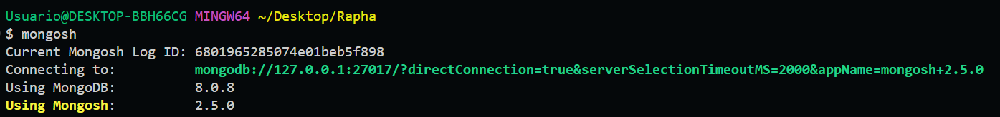

# TP2 Bases de Datos 2

#### Participantes:
- [Raphael Nicaise](https://github.com/RaphaelNicaise)
- [Santiago Segal](https://github.com/Santucho12)
- [Abner Grgurich](https://github.com/Abner2646)
- [Nicolas Cordano](https://github.com/NACXIIX)

####  📚 Puntos: 
[1](#1)
[2](#2)
[3](#3)
[4](#4)
[5](#5)
[6](#6)
[7](#7)
[8](#8)
[9](#9)
[10](#10)

<hr style="height:1px; border:none; background-color:#e1e4e8;" />

Nos conectamos a la base de datos de `MongoDB` mediante **mongosh**:


<hr style="height:1px; border:none; background-color:#e1e4e8;" />

### 1. ➡ [🔗Script](./scripts/script1.mongodb.js)

- Creamos la base de datos `empresa`: 
```js
use ("empresa");
```
- Creamos la coleccion `empleados`:
```js
db.createCollection("empleados");
```
- Insertamos 3 documentos (`empleados`) en la coleccion:
```js
db.empleados.insertMany([
    {nombre:'Rapha', edad: 20, puesto: 'pasante'},
    {nombre:'Pepe', edad: 32, puesto: 'Backend Developer'},
    {nombre:'Juan', edad: 41, puesto: 'Ingeniero de Datos'}
]);
```

- Hacemos update sobre un empleado:
```js
db.empleados.updateOne(
    {nombre: 'Rapha'},
    {$set: {puesto: 'Backend Developer'}}
);
```

- Hacemos delete sobre un empleado que sea pasante:
```js
db.empleados.deleteOne(
    {puesto: 'pasante'}
);
```

- Y asi queda la coleccion `empleados`:
```js
[
  {
    _id: ObjectId('68019d5e85074e01beb5f8a3'),
    nombre: 'Pepe',
    edad: 32,
    puesto: 'Backend Developer JR'
  },
  {
    _id: ObjectId('68019d5e85074e01beb5f8a4'),
    nombre: 'Juan',
    edad: 41,
    puesto: 'Ingeniero de Datos'
  }
]
```
<hr style="height:1px; border:none; background-color:#e1e4e8;" />


### 2. ➡ [🔗Script](./scripts/script2.mongodb.js)

- Queremos los empleados que tengan mas de 25 y menos de 40 años:
```js
db.empleados.find({
    $and: [
        {edad: {$gt: 25}}, // mayor a 25
        {edad: {$lt: 40}} // menor a 40
    ] 
})
```

```js
[
  {
    _id: ObjectId('68019d5e85074e01beb5f8a3'),
    nombre: 'Pepe',
    edad: 32,
    puesto: 'Backend Developer JR'
  }
]
```
<hr style="height:1px; border:none; background-color:#e1e4e8;" />

### 3. ➡ [🔗Script](./scripts/script3.mongodb.js)


- Queremos recuperar solo el nombre y la edad de los empleados:
```js
use("empresa");

db.empleados.find(
    {}, // esto indica que no hay filtro
    { _id: 0, nombre: 1, puesto: 1 } // 0 no selecciona, 1 si (edad no se selecciona directamente) 
)
```

```json
[
  {
    "nombre": "Pepe",
    "puesto": "Backend Developer JR"
  },
  {
    "nombre": "Juan",
    "puesto": "Ingeniero de Datos"
  }
]
```

<hr style="height:1px; border:none; background-color:#e1e4e8;" />

### 4. ➡ [🔗Script](./scripts/script4.mongodb.js)

- Agregamos a cada documento (`empleado`) el campo direccion con datos de la calle, la ciudad y codigo postal:
```js
use("empresa");

db.empleados.updateMany(
    {}, // actualizamos todos
    {
        $set: {
            "direccion":{
                "calle": "calle123",
                "ciudad": "Bahia Blanca",
                "codigo_postal": 8000
            }
        }
    }
);
```

```js
[  
  {
    _id: ObjectId('68019d5e85074e01beb5f8a3'),
    nombre: 'Pepe',
    edad: 32,
    puesto: 'Backend Developer JR',
    direccion: { calle: 'calle123', ciudad: 'Bahia Blanca', codigo_postal: 8000 }
  },
  {
    _id: ObjectId('68019d5e85074e01beb5f8a4'),
    nombre: 'Juan',
    edad: 41,
    puesto: 'Ingeniero de Datos',
    direccion: { calle: 'calle123', ciudad: 'Bahia Blanca', codigo_postal: 8000 }
  }
]
```


<hr style="height:1px; border:none; background-color:#e1e4e8;" />

### 5. ➡ [🔗Script](./scripts/script5.mongodb.js)

- Creamos una nueva coleccion llamada `ventas`:
```js
use("empresa");

db.createCollection("ventas");
```

<details>
<summary>(open) Insertamos documentos creados con IA</summary>

```js
db.ventas.insertMany([
    { producto: "Laptop", cantidad: 1, precio_unitario: 1200 },
    { producto: "Mouse", cantidad: 2, precio_unitario: 25 },
    { producto: "Teclado", cantidad: 3, precio_unitario: 45 },
    { producto: "Monitor", cantidad: 1, precio_unitario: 200 },
    { producto: "Impresora", cantidad: 1, precio_unitario: 150 },
    { producto: "Laptop", cantidad: 2, precio_unitario: 1200 },
    { producto: "Mouse", cantidad: 1, precio_unitario: 25 },
    { producto: "Teclado", cantidad: 1, precio_unitario: 45 },
    { producto: "Monitor", cantidad: 2, precio_unitario: 200 },
    { producto: "Impresora", cantidad: 1, precio_unitario: 150 }
]);
```
</details>

- Agrupamos por producto y sumamos la cantidad de venta_total (cantidad * precio_unitario):

```js
db.ventas.aggregate({
    $group: {
        _id: "$producto", // agrupamos por producto
        total_ventas: { $sum: { $multiply: ["$cantidad", "$precio_unitario"] } }
        // total_venta = cantidad * precio_unitario
    }
});
```

```json
[
  {
    "_id": "Teclado",
    "total_ventas": 360
  },
  {
    "_id": "Impresora",
    "total_ventas": 600
  },
  {
    "_id": "Laptop",
    "total_ventas": 7200
  },
  {
    "_id": "Mouse",
    "total_ventas": 150
  },
  {
    "_id": "Monitor",
    "total_ventas": 1200
  }
]
```

<hr style="height:1px; border:none; background-color:#e1e4e8;" />

### 6. ➡ [🔗Script](./scripts/script6.mongodb.js)

- Creamos la coleccion `clientes`, e insertamos documentos (clientes):
```js
db.createCollection("clientes");

db.clientes.insertMany([
    {nombre: 'Mauro', apellido: 'Icardi'},
    {nombre: 'Adam', apellido: 'Sandler'},
    {nombre: 'Diego', apellido: 'Latorre'},
    {nombre: 'Valeria', apellido: 'Lynch'},
    {nombre: 'Wanda', apellido: 'Nara'},
    {nombre: 'Lionel', apellido: 'Messi'}
]);
```
- Creamos un `indice compuesto` sobre los campos nombre y apellido:
```js
db.clientes.createIndex(
    { nombre: 1, apellido: 1 } // 1 indica orden ascendente
);
```

- El indice solo funciona si se hace una busqueda por nombre y apellido, o por nombre
- Si buscamos solo por apellido, no se usara el indice

<hr style="height:1px; border:none; background-color:#e1e4e8;" />

### 7. ➡ [🔗Script](./scripts/script7.mongodb.js)

- Creamos la base de datos `colegio`, las colecciones `cursos` y `alumnos`:
```js
use("colegio");

db.createCollection("cursos");

db.createCollection("alumnos");
```

- Declaramos ids de `cursos` para tenerlos como constantes y poder asociarlos a los cursos, y obviamente a los `alumnos`:
```js
const id_curso1 = ObjectId();
const id_curso2 = ObjectId();
const id_curso3 = ObjectId();
const id_curso4 = ObjectId();
```

- Insertamos los `cursos`:
```js
db.cursos.insertMany([
    {
        _id: id_curso1,
        nombre: "Probabilidad y Estadistica",
        profesor: "Juan Perez",
        clases:[
            {dia:"martes", hora:"8am", aula:"704"},
            {dia:"jueves", hora:"8am", aula:"704"}
        ]
    },
    {
        _id: id_curso2,
        nombre: "Programacion I",
        profesor: "Damian Ene",
        clases:[
            {dia:"lunes", hora:"8am", aula:"707"},
            {dia:"miercoles", hora:"8am", aula:"707"}
        ]
    },
    {
        _id: id_curso3,
        nombre: "Programacion II",
        profesor: "Damian Ene",

        clases:[
            {dia:"lunes", hora:"10am", aula:"203"},
            {dia:"miercoles", hora:"10am", aula:"203"}
        ]
    },
    {
        _id: id_curso4,
        nombre: "Base de Datos I",
        profesor: "Gustavo Ramoscelli",
        clases:[
            {dia:"martes", hora:"10am", aula:"704"},
            {dia:"jueves", hora:"10am", aula:"704"}
        ]
    }
]);
```

- Insertamos los `alumnos`, cada uno con sus respectivos `cursos`:
```js
db.alumnos.insertMany([
    {   
        _id: ObjectId(), 
        nombre: "Raphael", 
        apellido: "Nicaise", 
        cursos:[
            {curso: id_curso1, estado: "cursando"},
            {curso: id_curso2, estado: "aprobada", nota:9},
            {curso: id_curso3, estado:"aprobada", nota: 10},
            {curso: id_curso4, estado: "aprobada", nota: 9}
        ]
    },        
    {
        _id: ObjectId(), 
        nombre: "Nereo", 
        apellido: "Champagen",
        cursos:[
            {curso: id_curso1, estado: "cursando"},
            {curso: id_curso2, estado: "cursando"},
            {curso: id_curso4, estado: "aprobada", nota: 7},
        ]
    },
    {
        _id: ObjectId(), 
        nombre: "Leandro", 
        apellido: "Laspada",
        cursos:[
            {curso: id_curso1, estado: "cursando"},
            {curso: id_curso2, estado: "cursando"},
            {curso: id_curso3, estado: "aprobada", nota: 8},
            {curso: id_curso4, estado: "aprobada", nota: 9}
        ]
    },
    {
        _id: ObjectId(), 
        nombre: "Patrtricio", 
        apellido: "Sardelli",
        cursos:[
            {curso: id_curso1, estado: "cursando"},
            {curso: id_curso2, estado: "cursando"},
            {curso: id_curso3, estado:"aprobada", nota: 10},
            {curso: id_curso4, estado:"aprobada", nota: 9}
        ]
    }
]);
```


<hr style="height:1px; border:none; background-color:#e1e4e8;" />

### 8. ➡ [🔗Script](./scripts/script8.mongodb.js)

- Hacemos un `join`entre las colecciones `cursos` y `alumnos`, para obtener los alumnos que cursan cada curso:
```js
db.cursos.aggregate([
    {
        $lookup: {
            from: "alumnos",
            localField: "_id", // campo id del curso
            foreignField: "cursos.curso", // campo id del curso en la coleccion alumnos
            as: "alumnos"
        }
    }
]);
```
>  [Este es el Output ](./scripts/outputs/output7.js)


> ℹ️ Para que no queden tan extenso los datos, a la hora de hacer el join podriamos agregar un $project para que solo nos devuelva el nombre y el apellido de los `alumnos`

<hr style="height:1px; border:none; background-color:#e1e4e8;" />

### 9.

 Un `Replica Set` en MongoDB es un *conjunto de instancias* de bases de datos que mantienen *copias exactas de los mismos datos*. La principal ventaja de usar un Replica Set es la `alta disponibilidad`: si uno de los nodos (servidores) falla, otro nodo secundario puede ser promovido automaticamente a primario, asegurando que la *base de datos siga funcionando sin interrupciones*. Esto minimiza el riesgo de pérdida de datos y mejora la fiabilidad del sistema.

Otra ventaja importante es la distribución de la carga de lectura. En un Replica Set, las lecturas pueden ser distribuidas entre los nodos secundarios, lo que alivia la carga en el nodo primario y mejora el rendimiento general del sistema. Además, los nodos secundarios pueden ser utilizados para hacer copias de seguridad de los datos, sin afectar la operación normal del sistema. Esta redundancia asegura que los datos estén siempre disponibles y accesibles, incluso en situaciones de fallo.

---

El `sharding` en MongoDB es fundamental para manejar bases de datos de *alto volumen* al permitir *distribuir los datos en múltiples servidores o nodos* `(shards)`. Esto proporciona escalabilidad horizontal, lo que significa que, a medida que los datos o el trafico aumentan, puedes agregar más servidores para manejar la carga. Esto ayuda a evitar cuellos de botella y asegura que el rendimiento se mantenga alto incluso con grandes cantidades de datos.

Ademas, el sharding mejora el rendimiento de la base de datos al balancear la carga de trabajo entre varios nodos. Cada shard maneja una parte de los datos, lo que permite realizar operaciones de lectura y escritura mas rápidas. Aunque las consultas que abarcan varios shards pueden ser un poco mas lentas, el diseño adecuado del sharding puede optimizar las consultas y distribuir eficientemente los datos, manteniendo un buen rendimiento a medida que la base de datos crece.


<hr style="height:1px; border:none; background-color:#e1e4e8;" />

### 10. ➡ [🔗Script(js)](./scripts/script10.mongodb.js) | [Script(bat)](./scripts/script10.bat)

- Creamos al user **admin** con el rol `readWrite` sobre la base de datos `empresa`:
```js
use("empresa");

db.createUser(
    {
        user: "admin",
        pwd: "1234",
        roles: [
            "readWrite" // Permisos de lectura y escritura
        ]
    }
);
```

- Luego la consigna nos pide mostrar los pasos para crear un script en `bash` que permita crear un backup de una base de datos, en este ejemplo usaremos la base de datos `empresa`

> ℹ️ En el caso de no tener `mongodump` y `mongorestore` instalados, se puede instalar desde el siguiente link: [MongoDB Database Tools](https://www.mongodb.com/try/download/database-tools)

```bat
mongodump --db empresa --out ./backups
```

- Va a enviar el archivo .bson a la carpeta seleccionada en --out

- Para `restaurar` la base de datos, usamos el siguiente comando:
```bat
mongorestore --db empresa ./backups
```